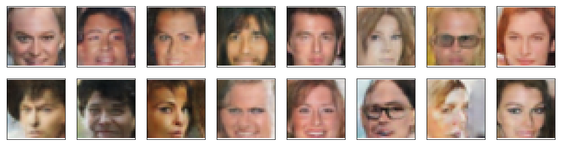

# Face Generation

Face Generator Project is a part of Udacity Deep Learning Nanodegree.

Generate new faces using Generative Adversarial Networks (GANs). I defined and trained a DCGAN on a dataset of faces. The goal was to get a generator network to generate *new* images of faces that look as realistic as possible!

The project will be broken down into a series of tasks from **loading in data to defining and training adversarial networks**. At the end of the notebook, you'll be able to visualize the results of your trained Generator to see how it performs; your generated samples should look like fairly realistic faces with small amounts of noise.

## Get the Data

You'll be using the [CelebFaces Attributes Dataset (CelebA)](http://mmlab.ie.cuhk.edu.hk/projects/CelebA.html) to train your adversarial networks.

## Pre-processed Data

Some sample data is show below.

## Human faces generated by the DCGAN

Example #1

Example #2

